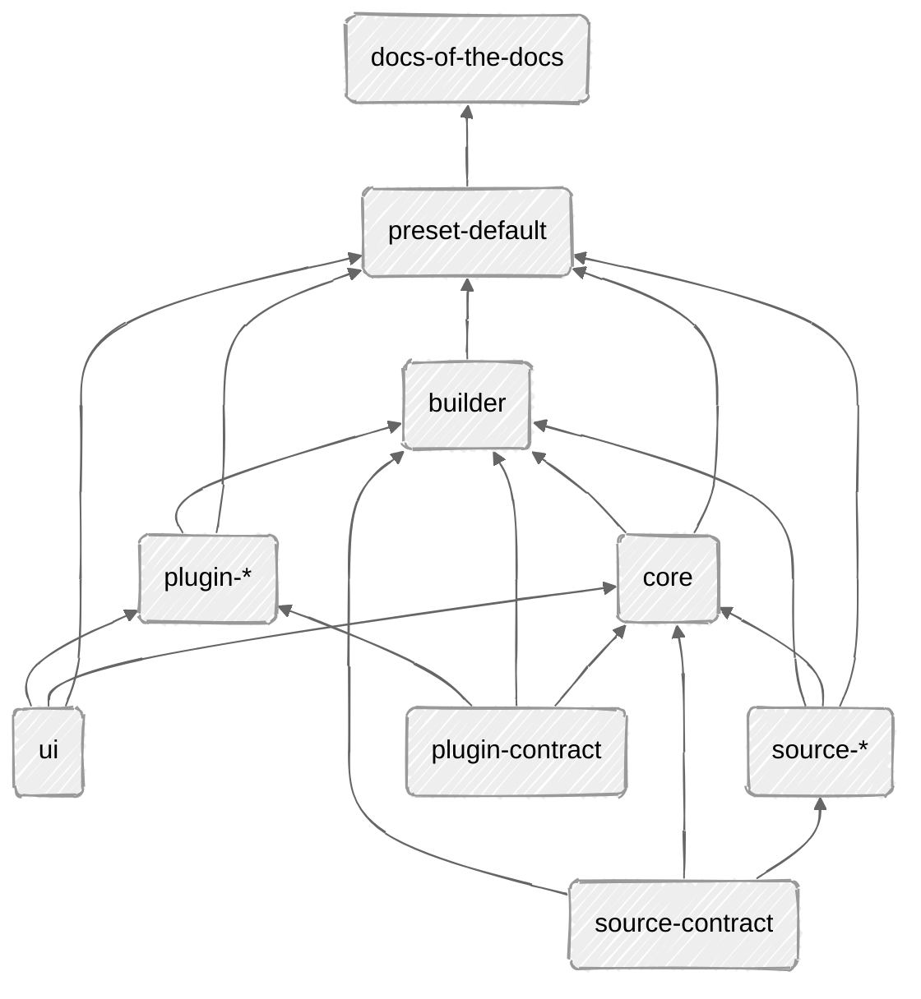

## Packages Overview

```
the-docs/
├── docs/
├── apps/
│   └── docs-of-the-docs/
└── packages/
    ├── core/
    ├── preset-default/
    ├── source-contract/
    ├── source-*/
    ├── builder/
    ├── plugin-contract/
    ├── plugin-*/
    └── ui/
```

## Packages References



## Packages Boundaries

### apps/docs-of-the-docs

- Define the content location and project-specific overrides
- Forward the required Vite and React Router entry points to the default preset
- Avoid assembling sources, routes, UI, and default plugins itself

Simplified usage:

```typescript
// docs.config.ts

import { defineConfig } from "@the-docs/preset-default"

export default defineConfig({
  contentRoot: new URL("../../docs", import.meta.url),
})
```

```typescript
// app/routes.ts

import { createRoutes } from "@the-docs/preset-default/routes"

export default createRoutes()
```

```typescript
// vite.config.ts

import { createViteConfig } from "@the-docs/preset-default/vite"
import docsConfig from "./docs.config"

export default createViteConfig(docsConfig)
```

### packages/preset-default

- Compose the default source, UI, routes, and plugins
- Own the default root layout and route modules
- Provide Vite and React Router configuration factories
- Depend on lower-level packages without introducing dependencies back from them
- Allow focused opt-outs and overrides without exposing the full assembly in the app

### packages/core

- Create router
- Combine source and ui (ui + url state)
    - Search
    - Breadcrumbs

### packages/builder

* Plugin image generation
* Vite integration

### packages/source-contract

* Return html
* Return meta-data

### packages/source-\*

- Utils to read from source (file-systems)
    * Read content
    * Read frontmatter
    * Read tags

### packages/plugin-contract

* Plugin interface and `defineMdxPlugin`
* Separation between build-time and runtime
    - plugin/build
    - plugin/

### packages/plugin-\*

* Implement plugin contact
* Parser, component

### packages/ui

- Everything ui related
    - Component
    - Hooks