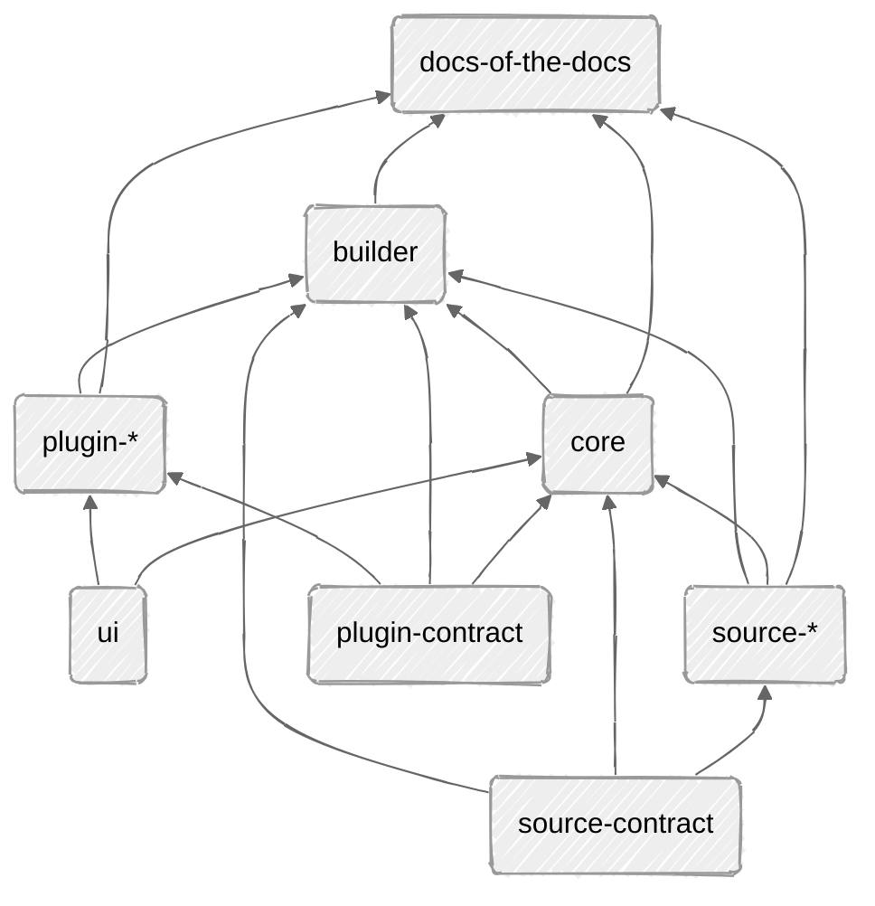

## Packages Overview

```
the-docs/
├── docs/
├── apps/
│   └── docs-of-the-docs/
└── packages/
    ├── core/
    ├── source-contract/
    ├── source-*/
    ├── builder/
    ├── plugin-contract/
    ├── plugin-*/
    └── ui/
```

## Packages References



## Packages Boundaries

### apps/docs-of-the-docs

* Use create router
* Assign plugin
* Define sources

Simplify Usage:

```typescript
// docs.config.ts

import { createConfig } from "@the-docs/core/config";
import { createFilesystemSource } from "@the-docs/source-fs";
import { mermaidPlugin } from "@the-docs/plugin-mermaid";

export default createConfig({
  source: createFilesystemSource({
    root: "./docs",
  }),
  plugins: [mermaidPlugin()],
});
```

```
// app/routes.ts

import { createRouter } from "@the-docs/core/router";
import config from "../docs.config";

export default createRouter(config);
```

```
// vite.config.ts

import { reactRouter } from "@react-router/dev/vite";
import tailwindcss from "@tailwindcss/vite";
import { defineConfig } from "vite";

import { buildDocs } from "@the-docs/builder";
import docsConfig from "./docs.config";

export default defineConfig({
  resolve: {
    tsconfigPaths: true,
  },

  plugins: [
    buildDocs({
      config: docsConfig,
    }),

    tailwindcss(),
    reactRouter(),
  ],
});
```

### packages/core

- Create router
- Combine source and ui (ui + url state)
    - Search
    - Breadcrumbs

### packages/builder

* Plugin image generation
* Vite integration

### packages/source-contract

* Return html
* Return meta-data

### packages/source-\*

- Utils to read from source (file-systems)
    * Read content
    * Read frontmatter
    * Read tags

### packages/plugin-contract

* Plugin interface and `defineMdxPlugin`
* Separation between build-time and runtime
    - plugin/build
    - plugin/

### packages/plugin-\*

* Implement plugin contact
* Parser, component

### packages/ui

- Everything ui related
    - Component
    - Hooks